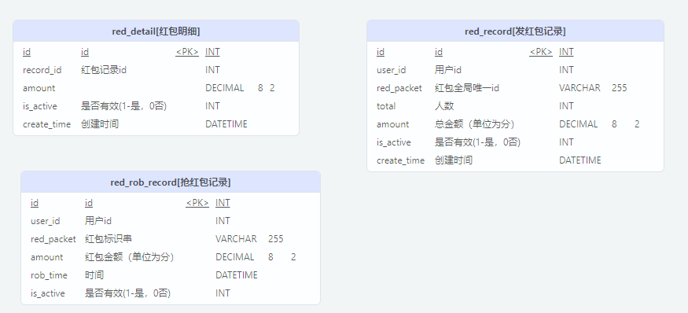

抢红包



示例来源：<<分布式中间件技术实战：Java版>> 第四章

学习目标： Redis分布式锁在高并发场景下的运用


## 普通版本分支
通过 jMeter 压力测试时（./TestPlan.jmx），会出现问题数据
```
2022-02-22 20:24:24.177  INFO 15572 --- [o-8080-exec-262] c.e.r.service.impl.RedPacketService      : 用户抢到红包了，userId=[10002],redPacket=[red:1001:27474708893200],amount=[226]
2022-02-22 20:24:24.177  INFO 15572 --- [o-8080-exec-320] c.e.r.service.impl.RedPacketService      : 用户抢到红包了，userId=[10002],redPacket=[red:1001:27474708893200],amount=[199]
2022-02-22 20:24:24.177  INFO 15572 --- [o-8080-exec-144] c.e.r.service.impl.RedPacketService      : 用户抢到红包了，userId=[10004],redPacket=[red:1001:27474708893200],amount=[98]
2022-02-22 20:24:24.177  INFO 15572 --- [o-8080-exec-232] c.e.r.service.impl.RedPacketService      : 用户抢到红包了，userId=[10003],redPacket=[red:1001:27474708893200],amount=[134]
2022-02-22 20:24:24.177  INFO 15572 --- [o-8080-exec-265] c.e.r.service.impl.RedPacketService      : 用户抢到红包了，userId=[10001],redPacket=[red:1001:27474708893200],amount=[343]
```

比如，上面的日志可以看到 10002 用户抢了两个红包。
